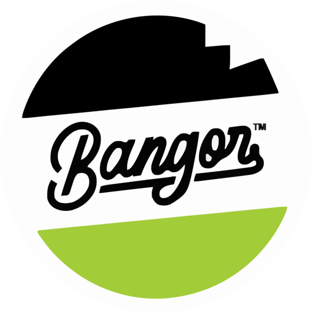

# Company Profile CMS — Multi‑Tenant Dashboard

**A multi‑site content management dashboard for company‑profile websites — blog, products, promos, hero sections, store locator, and contact submissions, all behind per‑site role‑based access control.**

---

> **Showcase repository.** This repo contains a project overview, a few representative PHP source files, and visual assets only. The full application source code lives in a private repository.

## Overview

Company Profile CMS is an admin dashboard that powers the public‑facing websites of a multi‑brand business. One installation manages **multiple sites (tenants)** from a single panel: an operator picks a site, and every list and mutation is scoped to that site. Content editors manage blogs and promos; marketers manage homepage hero banners and product catalogs; managers handle store locations and incoming contact/partnership requests — each constrained by what their role on that specific site allows.

## Key Features

- **Multi‑tenant site management** — switch between sites; all data is scoped per site to keep tenants isolated.
- **Role‑Based Access Control (RBAC)** — per‑site roles and permissions (e.g. a dedicated *Promo Manager* role); users only see and act on what their role grants.
- **Blog** — posts, categories, and tags with a rich‑text editor (TipTap) and inline content‑image uploads.
- **Products** — products, categories, and attribute groups for catalog management.
- **Promos** — time‑bound promotional content per site.
- **Hero sections** — manage homepage hero banners/slides.
- **Store locator** — stores with province/city reference data.
- **Contact submissions** — capture and review *Big Order* and *Partnership* inquiries from the public site.
- **Dashboard** — overview with SEO‑oriented insights.
- **Authentication** — login, email verification, and password reset flows.

## Tech Stack

| Layer | Technology |
|-------|-----------|
| Backend | **Laravel** (PHP) · Sanctum auth |
| Frontend | **React 18 + TypeScript** · Inertia.js |
| Styling | **Tailwind CSS v4** |
| Editor | TipTap rich‑text |
| FE routing | Ziggy |
| Build | Vite |
| Icons / UI | lucide‑react · Headless UI |

## Architecture Highlights

- **Inertia.js monolith** — Laravel renders React pages without a separate REST layer, keeping a single deployable while delivering an SPA‑like UX.
- **Domain‑Driven structure** — code is organized by domain (`Blog`, `Product`, `Contact`, `Core`) with thin controllers delegating to single‑responsibility **Actions** and **Services**.
- **Per‑site scoping as a first‑class concern** — tenancy is enforced at the query layer so data never leaks between brands.
- **Policy‑driven authorization** — resource policies are evaluated against per‑site role permissions, with friendly “no access” messaging instead of raw 403s.

## Representative Source

A couple of real PHP files from the codebase are included to illustrate the style and architecture:

- [`app/Domains/Blog/Actions/CreateBlog.php`](app/Domains/Blog/Actions/CreateBlog.php) — single‑responsibility Action that creates a blog scoped to its tenant.
- [`app/Domains/Blog/Services/BlogQueryService.php`](app/Domains/Blog/Services/BlogQueryService.php) — query service with per‑site scoping, filtering, and sorting.

## Brand

> Visual assets shown here are brand materials from the live project.

